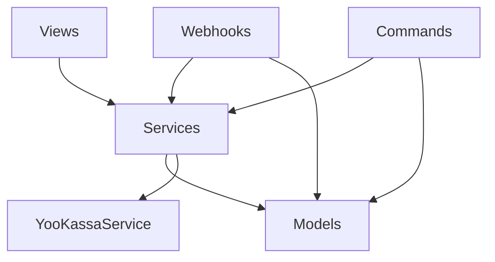

# Архитектура Billing

## Обзор

Billing — модуль для управления подписками, платежами и лимитами в EatFit24.

```
billing/
├── models.py          # Модели данных (источник истины)
├── views.py           # API endpoints для фронтенда
├── services.py        # Бизнес-логика + YooKassaService
├── usage.py           # Дневные лимиты (DailyUsage)
├── throttles.py       # Rate limiting
├── serializers.py     # Валидация и форматирование
├── urls.py            # Маршруты API
├── admin.py           # Django Admin
├── webhooks/          # Обработка webhook YooKassa
│   ├── views.py       # Приём webhook
│   ├── handlers.py    # Бизнес-логика событий
│   └── utils.py       # IP allowlist
└── management/commands/
    ├── process_recurring_payments.py
    └── cleanup_expired_subscriptions.py
```

## Компоненты

### Models (источник истины)

| Модель | Назначение |
|--------|------------|
| `SubscriptionPlan` | Тарифные планы (FREE, PRO_MONTHLY, PRO_YEARLY) |
| `Subscription` | Подписка пользователя (1:1 с User) |
| `Payment` | Платёж (PENDING → SUCCEEDED/CANCELED) |
| `Refund` | Возврат средств |
| `WebhookLog` | Лог входящих webhook |
| `DailyUsage` | Дневное использование (лимиты) |

### Views (API)

| Endpoint | Метод | Назначение |
|----------|-------|------------|
| `/billing/plans/` | GET | Список активных планов |
| `/billing/me/` | GET | Статус подписки и лимиты |
| `/billing/create-payment/` | POST | Создание платежа |
| `/billing/subscription/` | GET | Детали подписки |
| `/billing/subscription/autorenew/` | POST | Настройка автопродления |
| `/billing/payment-method/` | GET | Информация о карте |
| `/billing/payments/` | GET | История платежей |
| `/billing/bind-card/start/` | POST | Привязка карты |
| `/billing/webhooks/yookassa` | POST | Webhook YooKassa |

### Services (бизнес-логика)

**YooKassaService** — единственный клиент YooKassa:
- `create_payment()` — создание платежа
- `create_recurring_payment()` — рекуррентный платёж
- `get_payment_info()` — информация о платеже

**Функции сервисного слоя:**
- `create_subscription_payment()` — полный flow создания
- `activate_or_extend_subscription()` — продление подписки
- `ensure_subscription_exists()` — гарантия наличия подписки

### Webhooks

Отдельный субмодуль `webhooks/`:
- **views.py** — приём, валидация IP, идемпотентность
- **handlers.py** — обработка событий (payment.succeeded и т.д.)
- **utils.py** — IP allowlist YooKassa

## Потоки данных

### Создание платежа

```
Frontend → POST /billing/create-payment/
    → views.create_payment()
    → services.create_subscription_payment()
    → YooKassaService.create_payment()
    → YooKassa API
    ← confirmation_url
← Frontend redirect
```

### Подтверждение платежа

```
YooKassa → POST /billing/webhooks/yookassa
    → webhooks/views.yookassa_webhook()
    → IP validation
    → webhooks/handlers.handle_yookassa_event()
    → Payment.mark_as_succeeded()
    → services.activate_or_extend_subscription()
← 200 OK
```

## Зависимости


