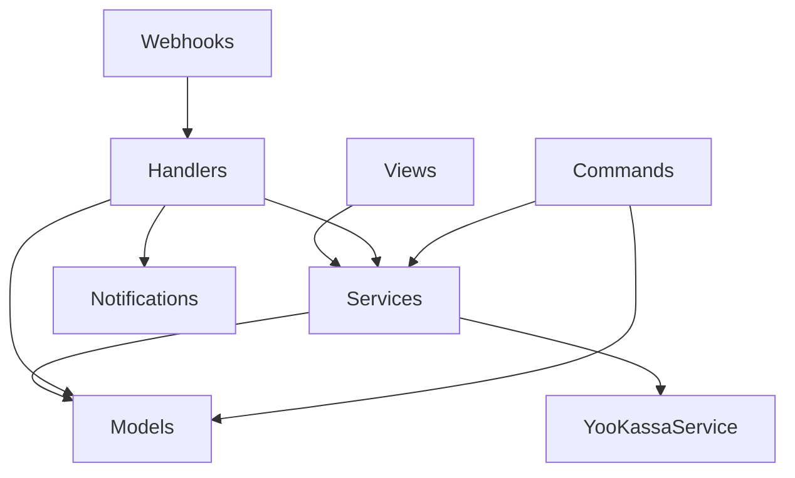

# Архитектура Billing

## Обзор

Billing — модуль для управления подписками, платежами и лимитами в EatFit24.

```
billing/
├── models.py          # Модели данных (источник истины)
├── views.py           # API endpoints для фронтенда
├── services.py        # Бизнес-логика + YooKassaService
├── notifications.py   # Telegram-уведомления о подписках
├── usage.py           # Дневные лимиты (DailyUsage)
├── throttles.py       # Rate limiting
├── serializers.py     # Валидация и форматирование
├── urls.py            # Маршруты API
├── admin.py           # Django Admin
├── webhooks/          # Обработка webhook YooKassa
│   ├── views.py       # Приём webhook
│   ├── handlers.py    # Бизнес-логика событий
│   ├── tasks.py       # Celery tasks (async processing)
│   └── utils.py       # IP allowlist
└── management/commands/
    ├── process_recurring_payments.py
    └── cleanup_expired_subscriptions.py
```

---

## Компоненты

### Models (источник истины)

| Модель | Назначение |
|--------|------------|
| `SubscriptionPlan` | Тарифные планы (FREE, PRO_MONTHLY, PRO_YEARLY) |
| `Subscription` | Подписка пользователя (1:1 с User) |
| `Payment` | Платёж (PENDING → SUCCEEDED/CANCELED) |
| `Refund` | Возврат средств |
| `WebhookLog` | Лог входящих webhook |

### Services (бизнес-логика)

**YooKassaService** — единственный клиент YooKassa:
- `create_payment()` — создание платежа
- `create_recurring_payment()` — рекуррентный платёж
- `get_payment_info()` — информация о платеже

**Функции сервисного слоя:**
- `create_subscription_payment()` — полный flow создания
- `activate_or_extend_subscription()` — продление подписки
- `ensure_subscription_exists()` — гарантия наличия подписки
- `invalidate_user_plan_cache()` — инвалидация кеша плана

### Notifications (уведомления)

- `send_pro_subscription_notification()` — Telegram-уведомление админам о новой PRO подписке

### Webhooks (субмодуль)

| Файл | Назначение |
|------|------------|
| `views.py` | Приём, валидация IP, идемпотентность |
| `handlers.py` | Бизнес-логика событий |
| `tasks.py` | Celery tasks для async обработки |
| `utils.py` | IP allowlist YooKassa |

---

## Потоки данных

### Создание платежа

```
Frontend → POST /billing/create-payment/
    → views.create_payment()
    → services.create_subscription_payment()
    → YooKassaService.create_payment()
    → YooKassa API
    ← confirmation_url
← Frontend redirect
```

### Подтверждение платежа

```
YooKassa → POST /billing/webhooks/yookassa
    → webhooks/views.yookassa_webhook()
    → IP validation
    → Celery task (async)
    → webhooks/handlers.handle_yookassa_event()
    → Payment.mark_as_succeeded()
    → services.activate_or_extend_subscription()
    → notifications.send_pro_subscription_notification()
← 200 OK
```

---

## Зависимости



---

## 🚫 ЗАПРЕЩЕНО

### Views НЕ имеют права:
- ❌ Менять `Subscription` напрямую
- ❌ Читать `Payment` без сервисного слоя
- ❌ Вызывать YooKassa API напрямую (только через `YooKassaService`)
- ❌ Обновлять статус подписки

### Webhooks handlers.py НЕ должен:
- ❌ Делать HTTP запросы наружу
- ❌ Читать `request` напрямую (только переданные данные)
- ❌ Возвращать ничего кроме None

### Celery tasks:
- ❌ НЕ должны содержать бизнес-логику — только вызов handlers
- ❌ НЕ должны обращаться к request

---

## Ключевые файлы

| Файл | LOC | Описание |
|------|-----|----------|
| `models.py` | ~555 | 6 моделей данных |
| `views.py` | ~810 | API endpoints |
| `services.py` | ~510 | Бизнес-логика |
| `notifications.py` | ~280 | Telegram-уведомления |
| `webhooks/handlers.py` | ~355 | Обработка webhook событий |
