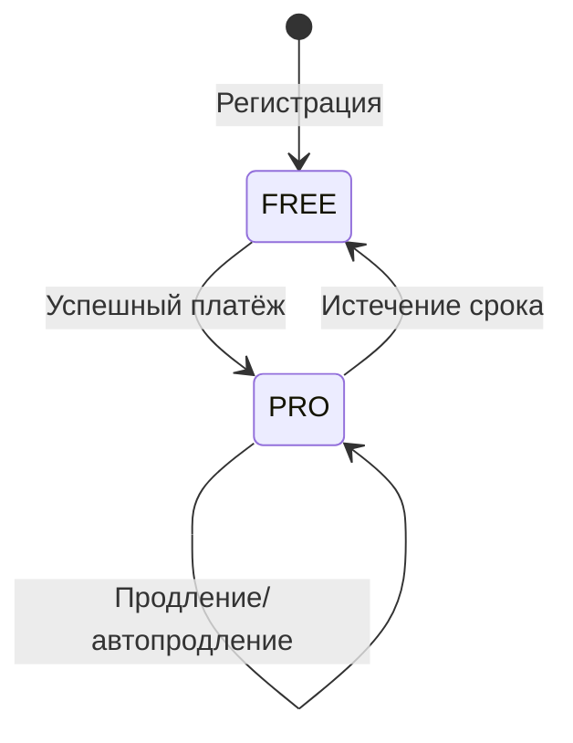

# Жизненный цикл подписки

## Модель Subscription

Каждый пользователь имеет **ровно одну** подписку (OneToOne с User).

```python
class Subscription(models.Model):
    user = models.OneToOneField(User, ...)
    plan = models.ForeignKey(SubscriptionPlan, ...)
    start_date = models.DateTimeField()
    end_date = models.DateTimeField()
    is_active = models.BooleanField(default=True)
    auto_renew = models.BooleanField(default=False)
    yookassa_payment_method_id = models.CharField(...)  # для автопродления
    card_mask = models.CharField(...)  # "•••• 1234"
    card_brand = models.CharField(...)  # "Visa"
```

## Состояния



### FREE (бесплатный)

- Создаётся автоматически при регистрации (сигнал `post_save`)
- `end_date` = 10 лет вперёд (условно бесконечно)
- `is_expired()` всегда возвращает `False` для FREE
- Лимиты определяются `SubscriptionPlan.daily_photo_limit`

### PRO (платный)

- Активируется после успешного webhook
- `end_date` = текущая дата + `plan.duration_days`
- При истечении → переход на FREE

## Переходы

### Регистрация → FREE

```python
# models.py: сигнал post_save(User)
@receiver(post_save, sender=User)
def create_free_subscription(sender, instance, created, **kwargs):
    if created:
        free_plan = SubscriptionPlan.objects.get(code="FREE")
        Subscription.objects.create(
            user=instance,
            plan=free_plan,
            start_date=now(),
            end_date=now() + timedelta(days=365*10),
        )
```

### FREE → PRO (покупка)

```python
# services.py: после webhook payment.succeeded
def activate_or_extend_subscription(*, user, plan_code, duration_days):
    subscription = ensure_subscription_exists(user)
    plan = get_plan_by_code_or_legacy(plan_code)
    
    if subscription.is_expired():
        subscription.start_date = now()
        subscription.end_date = now() + timedelta(days=duration_days)
    else:
        subscription.end_date += timedelta(days=duration_days)
    
    subscription.plan = plan
    subscription.is_active = True
    subscription.save()
```

### PRO → PRO (продление)

Если подписка ещё активна:
- `end_date` += `duration_days`
- План остаётся/меняется

### PRO → FREE (истечение)

Management command `cleanup_expired_subscriptions`:
```bash
python manage.py cleanup_expired_subscriptions
```

Переводит истёкшие подписки на FREE:
- `plan = FREE`
- `auto_renew = False`
- `is_active = True`

## Автопродление

### Включение

```
POST /api/v1/billing/subscription/autorenew/
{"enabled": true}
```

Требования:
- План ≠ FREE
- Есть сохранённый `payment_method_id`

### Процесс

1. `process_recurring_payments` запускается по cron
2. Находит подписки: `auto_renew=True`, истекают в ближайшие N дней
3. Создаёт рекуррентный платёж через YooKassa API
4. Webhook обрабатывает результат

### Отключение

```
POST /api/v1/billing/subscription/autorenew/
{"enabled": false}
```

## Проверка истечения

```python
def is_expired(self) -> bool:
    if self.plan.code == "FREE":
        return False  # FREE никогда не истекает
    return timezone.now() >= self.end_date

@property
def days_remaining(self):
    if self.plan.code == "FREE":
        return None  # безлимит
    if self.is_expired():
        return 0
    return (self.end_date - timezone.now()).days
```

## Кеширование

Эффективный план пользователя кешируется:
- Ключ: `user_plan:{user_id}`
- Инвалидация: после любого изменения подписки
- Используется для быстрой проверки лимитов
