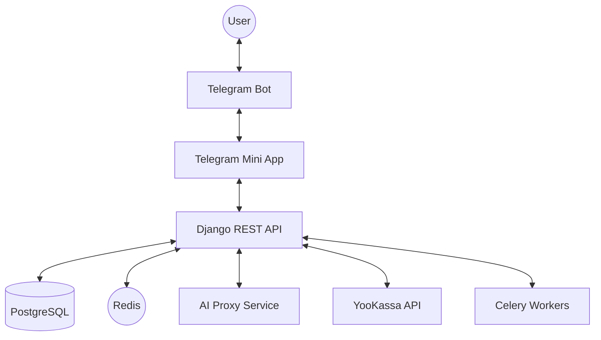

# System Architecture — EatFit24

> **Status:** SSOT
> **Vision:** AI-driven weight loss companion via Telegram

---

## 1. High-Level Diagram

---

## 2. Component Breakdown

### Backend (Django)
- **Monolith Core**: Handles users, meals, subscriptions, and logs.
- **apps/ai**: Logic for asynchronous image recognition polling.
- **apps/billing**: Webhook-first financial system.
- **apps/common**: Shared utilities and base models.

### Frontend (React + Vite)
- **Telegram Mini App**: Primary user interface.
- **Client Dashboard**: Progress tracking and meal history.
- **Trainer Panel**: Admin interface for managing clients.

### Bot (Node.js/Python)
- Acts as a gateway to the WebApp.
- Handles push notifications for subscriptions and reminders.

---

## 3. Data Flow

### Image Recognition Journey
1. **User** uploads a photo in the Mini App.
2. **Backend** saves the photo and triggers a **Celery Task**.
3. **Celery Task** normalizes the image and sends it to the **AI Proxy**.
4. **AI Proxy** interacts with LLMs (GPT-4o) and returns nutritional data.
5. **Backend** saves the items and updates the user's daily totals.
6. **Frontend** polls the API and displays results once processed.

---

## 4. Key Conventions

- **Timezones**: All timestamps are stored in UTC. Local conversion happens on the client.
- **Standard response**: API always returns structured JSON with clear status codes.
- **Polling**: We use poll-and-retry for long-running AI tasks instead of long HTTP connections.
