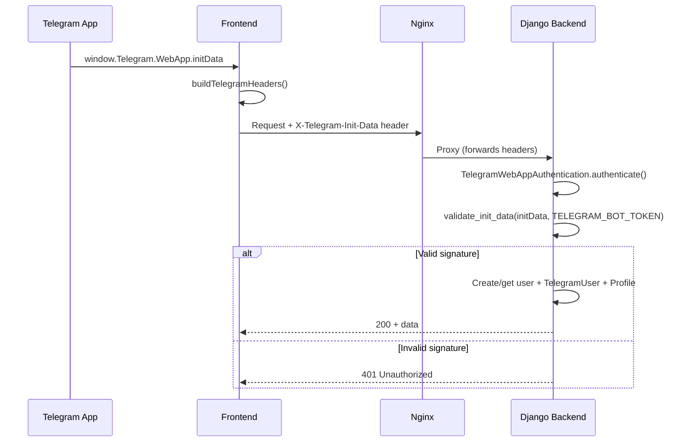

# Audit: PROD Breakage After AI/Settings Refactor

**Date:** 2025-12-22  
**Project:** EatFit24  
**Status:** ✅ ROOT CAUSE FIXED

---

## Executive Summary

После рефакторинга AI системы и settings в PROD наблюдались проблемы:
1. **Profile пустой** — не определяется пользователь
2. **"Не удалось загрузить тарифы"** — Billing раздел не работает

### ✅ ROOT CAUSE CONFIRMED & FIXED

**Nginx проксировал header под неправильным именем!**

```diff
# frontend/nginx.conf
- proxy_set_header X-TG-INIT-DATA $http_x_tg_init_data;
+ proxy_set_header X-Telegram-Init-Data $http_x_telegram_init_data;
```

Frontend отправлял `X-Telegram-Init-Data`, но nginx конвертировал его в `X-TG-INIT-DATA`, который backend не распознавал. В результате auth всегда возвращала 401.

### Applied Fixes:
1. **nginx.conf** — исправлено имя header на `X-Telegram-Init-Data`
2. **CORS_ALLOW_HEADERS** — добавлены все Telegram/debug headers
3. **TelegramWebAppAuthentication** — добавлена diagnostic logging

---

## Timeline: Что меняли

| Компонент | Изменения | Влияние на auth |
|-----------|-----------|-----------------|
| `frontend/nginx.conf` | **🔴 BUG:** `X-TG-INIT-DATA` вместо `X-Telegram-Init-Data` | **ROOT CAUSE** |
| `config/settings/base.py` | Рефакторинг, добавлен `__all__` | ✅ Без влияния |
| `config/settings/production.py` | Унификация | ✅ Без влияния |
| `apps/ai/*` | Рефакторинг AI endpoints | ✅ Без влияния на auth |
| `apps/telegram/auth/*` | ✅ Не менялось | — |

---

## Auth Flow: Полная цепочка



### Ключевые файлы

| Файл | Роль |
|------|------|
| `frontend/src/lib/telegram.ts` | Формирует headers (`X-Telegram-Init-Data`) |
| `frontend/src/shared/config/debug.ts` | `IS_DEBUG` = `import.meta.env.DEV` (build-time) |
| `backend/apps/telegram/auth/authentication.py` | DRF auth backends |
| `backend/apps/telegram/auth/services/webapp_auth.py` | HMAC validation |
| `backend/config/settings/base.py` | `TELEGRAM_BOT_TOKEN` читается из env |

---

## Debug Mode: Почему не работает в PROD

### Frontend (`IS_DEBUG`)
```typescript
// frontend/src/shared/config/debug.ts
export const IS_DEBUG = IS_DEV || (
  typeof window !== 'undefined' &&
  (window.location.hostname === 'localhost' || window.location.hostname === '127.0.0.1')
);
```

- `IS_DEV` = `import.meta.env.DEV` — **build-time переменная**
- В PROD build `IS_DEV = false`
- Даже если hostname не localhost → `IS_DEBUG = false`

### Backend (`DebugModeAuthentication`)
```python
# backend/apps/telegram/auth/authentication.py
def _is_dev_debug_allowed() -> bool:
    if not getattr(settings, "DEBUG", False):
        return False
    return bool(getattr(settings, "WEBAPP_DEBUG_MODE_ENABLED", True))
```

- **Требует `settings.DEBUG = True`**
- В PROD: `DEBUG = False` (из `production.py`)
- Даже с header `X-Debug-Mode: true` → `raise AuthenticationFailed("Debug mode is disabled")`

### Вывод
**Debug bypass ПОЛНОСТЬЮ отключён в PROD по design.** Это правильное поведение с точки зрения безопасности.

---

## Billing Endpoints: Анализ

| Endpoint | Method | Permission | Headers Required |
|----------|--------|------------|------------------|
| `/api/v1/billing/plans/` | GET | `AllowAny` | None |
| `/api/v1/billing/me/` | GET | `IsAuthenticated` | `X-Telegram-Init-Data` |
| `/api/v1/billing/subscription/` | GET | `IsAuthenticated` | `X-Telegram-Init-Data` |

### `/api/v1/billing/plans/` — Публичный
```python
@api_view(["GET"])
@permission_classes([AllowAny])
def get_subscription_plans(request):
    plans = SubscriptionPlan.objects.filter(is_active=True, is_test=False)
    ...
```

**Этот endpoint НЕ требует auth.** Если он возвращает ошибку, проблема в:
- Nginx routing
- CORS configuration
- DB не содержит активных планов

### `/api/v1/billing/me/` — Требует auth
```python
@api_view(["GET"])
@permission_classes([IsAuthenticated])
def get_subscription_status(request):
    ...
```

Если возвращает 401/403 → проблема с Telegram auth.

---

## Вероятные причины поломки

### 1. `TELEGRAM_BOT_TOKEN` не задан или неверный

**Проверка:**
```bash
docker compose exec -T backend python -c "
from django.conf import settings
token = getattr(settings, 'TELEGRAM_BOT_TOKEN', None)
print('TELEGRAM_BOT_TOKEN:', 'SET' if token else 'MISSING')
if token:
    print('Token starts with:', token[:10] + '...')
"
```

**Симптомы:**
- Все authenticated endpoints возвращают 401
- В логах: `[WebAppAuth] TELEGRAM_BOT_TOKEN is missing`

### 2. CORS блокирует запросы

**Проверка:**
```bash
docker compose exec -T backend python -c "
from django.conf import settings
print('CORS_ALLOWED_ORIGINS:', settings.CORS_ALLOWED_ORIGINS)
print('CORS_ALLOW_HEADERS:', settings.CORS_ALLOW_HEADERS)
"
```

**Симптомы:**
- В browser console: `CORS error`
- Запросы не доходят до backend

**Важно:** `x-telegram-init-data` должен быть в `CORS_ALLOW_HEADERS`.

### 3. Clock skew на сервере

**Проверка:**
```bash
timedatectl status
```

**Симптомы:**
- В логах: `[WebAppAuth] auth_date is in the future` или `[WebAppAuth] initData expired`
- initData валидируется с TTL 24 часа

### 4. Frontend не отправляет `X-Telegram-Init-Data`

**Проверка в Browser DevTools:**
1. Открыть Mini App в Telegram
2. DevTools → Network
3. Найти запрос к `/api/v1/billing/me/`
4. Проверить Request Headers

**Ожидаемый header:**
```
X-Telegram-Init-Data: query_id=...&user=...&auth_date=...&hash=...
```

**Если header отсутствует:**
- Frontend не получил `window.Telegram.WebApp.initData`
- Telegram WebApp SDK не загрузился
- Приложение открыто НЕ из Telegram

---

## Таблица диагностики

| Endpoint | Ожидаемый Status | Если 401 | Если 403 | Если 404 | Если 500 |
|----------|-----------------|----------|----------|----------|----------|
| `/health/` | 200 | — | — | Nginx routing | Backend down |
| `/api/v1/billing/plans/` | 200 | — | CORS issue | Nginx routing | DB/Migration |
| `/api/v1/billing/me/` | 200 | Auth failed | Auth failed | Nginx routing | Code error |
| `/api/v1/telegram/users/get-or-create/` | 200/201 | Auth failed | Auth failed | Endpoint removed? | Migration |

---

## Fix Plan

### Шаг 1: Проверить ENV в PROD

```bash
docker compose exec -T backend sh -c 'python - <<PY
import os
keys = [
    "DJANGO_SETTINGS_MODULE",
    "SECRET_KEY",
    "DEBUG",
    "ALLOWED_HOSTS",
    "CORS_ALLOWED_ORIGINS",
    "TELEGRAM_BOT_TOKEN",
    "YOOKASSA_MODE",
]
for k in keys:
    v = os.getenv(k)
    masked = "SET" if v else "MISSING"
    if k == "DEBUG":
        masked = v
    print(f"{k}: {masked}")
PY'
```

### Шаг 2: Проверить TELEGRAM_BOT_TOKEN

Убедиться, что:
1. Переменная задана в `.env` на сервере
2. Токен соответствует боту (@EatFit24_bot или вашему боту)
3. Токен передаётся в container через `docker-compose.yml`

### Шаг 3: Проверить CORS

Убедиться, что `CORS_ALLOWED_ORIGINS` включает:
- `https://eatfit24.ru`
- `https://web.telegram.org` (если нужно)

И `CORS_ALLOW_HEADERS` включает:
- `x-telegram-init-data`

### Шаг 4: Проверить логи

```bash
docker compose logs --tail=100 backend | grep -E "(WebAppAuth|401|403|Error)"
```

---

## Критичные ENV для PROD

| Переменная | Обязательно | Комментарий |
|------------|-------------|-------------|
| `TELEGRAM_BOT_TOKEN` | ✅ | Для HMAC validation |
| `SECRET_KEY` | ✅ | Django security |
| `ALLOWED_HOSTS` | ✅ | Django HOST header validation |
| `CORS_ALLOWED_ORIGINS` | ✅ | CORS для frontend |
| `POSTGRES_*` | ✅ | Database connection |
| `DEBUG` | ✅ = `False` | Security in PROD |

---

## Чек-лист перед деплоем

- [ ] `TELEGRAM_BOT_TOKEN` задан и корректен
- [ ] `CORS_ALLOWED_ORIGINS` включает домен frontend
- [ ] `ALLOWED_HOSTS` включает домен backend
- [ ] `DEBUG=False` в production
- [ ] Время на сервере синхронизировано (NTP)
- [ ] В БД есть активный FREE план (`code=FREE`, `is_active=True`)
